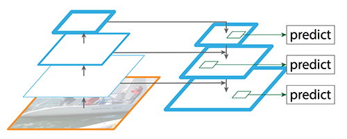
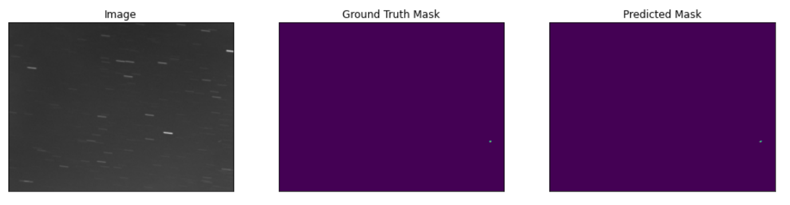
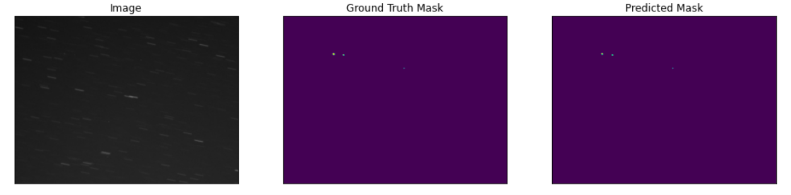
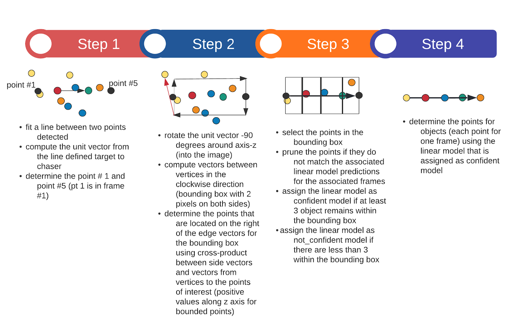
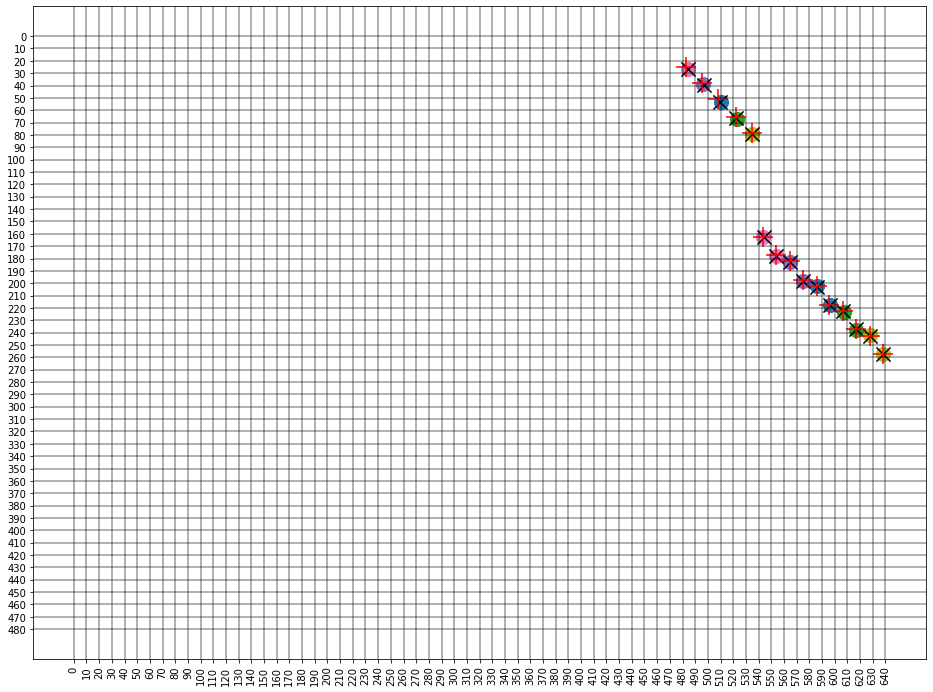
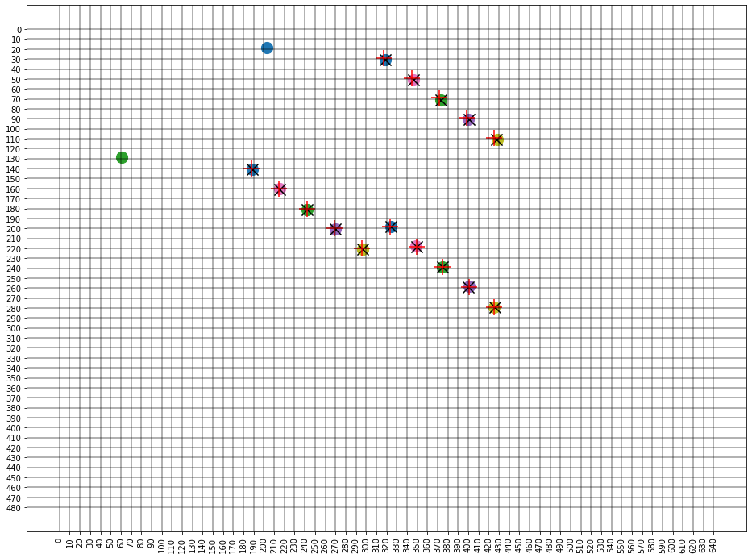

# geofpn
Spot the GEO:  Detecting Geosynchronous Space Objects with AI

# Introduction
An essential part of Space Surveillance - and Space Domain Awareness in general - is detecting, tracking, identifying and cataloging satellites. There are about 3800 operational satellites in orbit around the planet as of January 2021 [Source: ESA - Space debris by the numbers], in addition to hundreds of thousands of space debris that must also be tracked to avoid potential mission-ending collisions. As trackable resident space objects increase due to newly launched space objects and advanced space surveillance sensors, the task of detecting and tracking these resident space objects is slowly becoming more and more challenging for human experts. This presents a problem: we cannot continue with existing space surveillance systems which consist of human beings and expensive equipment, and must come up with autonomous and inexpensive solutions for detecting and tracking resident space objects.
The problem presented above is an important part of an entire field of research: introducing autonomy to space to keep safe access to space. We won’t focus on the entire field in this post, but rather on one specific problem - detecting satellites in geostationary orbit using low-cost telescopes using AI- which is a stepping stone towards leveraging inexpensive equipment alongside AI-powered algorithms to detect and track resident space objects. In the sections that follow, I will introduce you to the problem and explain how we aim to solve it using state-of-the-art Computer Vision algorithms.

# The problem of detecting satellites in telescope images
The problem was the basis of a competition organised by ESA’s Advanced Concepts Team and University of Adelaide in 2020 [see Kelvins]( https://kelvins.esa.int/spot-the-geo-satellites/home/). The aim here is to detect GEO and near-GEO satellites in sequences of 5 frames. The images are taken by a low cost ground-based telescope and are saved in the popular png format , and no other information is provided (including states of the space objects or their catalog IDs). 

Since GEO objects are mostly stationary relative to the observer, they appear more or less as dots whereas the background stars appear as streaks due to the exposure time of the camera. Some reasons why this is a difficult problem would be apparent after seeing the above frames. The distance between the camera and the target GEO object is so enormous (~35000 km) that each object only covers an area equivalent to 1 pixel of the image. In addition, due to atmospheric effects and exposure time of the camera, the signal received from the object is smeared over a few pixels, further dimming its brightness. Other factors such as atmospheric effects, light pollution, sensor defects and star occultation also contribute to the difficulty of the problem. 

There are some other issues, which are not so apparent at first glance, but pop up when going through the dataset manually. Some objects are not visible in all 5 frames, either because they are too dim, or because they are outside the frame. Few of the frames are overexposed, making it impossible even for human eyes to decipher the location of objects. Together, these difficulties make the problem extremely challenging.

# How we solve the problem
Our approach at solving the problem consists of two parts. First we detect the objects in each frame of each sequence, and then we track them across the frames. Correlating the positions of objects in different frames helps us clean the false detections made in the first part and boosts the overall accuracy of our solution.

## Part 1: Finding GEO objects using Deep Learning
In the first part, we use deep learning to detect GEO objects from individual images. To do so, we generate masks for each frame - images with pixel value equal to 1 for each pixel where an object is present and 0 where it is not. These masks are then used as target images to train a [Feature Pyramid Network (FPN)](https://arxiv.org/abs/1612.03144) , which learns how to generate masks from images.

A Feature Pyramid Network is a framework that is an object segmentation model to extract features from images and generate masks of objects of arbitrary sizes. It is composed of two parallel stacks of convolutional layers: a bottom-up pathway and a top-down pathway. The former stack is the same as a typical convolutional network which creates representations of the input image at various scales. The latter stack is responsible for upscaling semantically-strong feature maps from the top of the pyramid - low in resolution but containing more visual information about the image. These are then combined with same sized feature maps from the bottom-up pathway, merging information from both high and low level features maps which leads to improvement over standard feature extraction methods. 

This process generates a feature map at each level of the pyramid, and one or more of these can be selected (depending on the problem) in order to make predictions. The underlying convolutional network can have any architecture as the process is independent of the backbone network; for our purpose we use the EfficientNet-B7 architecture which is known to be highly efficient (hence the name!) while providing near state-of-the-art accuracy for image classification tasks.

Below we show some of the images alongside corresponding ground truth mask and the predicted mask:

As you can see, the model detects objects that are too faint to be seen by naked eyes, especially in the second and third image, while in the fourth image it missed one out of the three objects. Overall, our model is ~88 % accurate in generating masks. But wait, that’s not it! We can further improve our accuracy by tracking individual objects across frames, as explained below. 

## Part 2: Tracking objects across frames to improve detection accuracy
The second part of our solution uses a custom algorithm based on vector mathematics to track the objects across frames. This allows us to detect objects missed by the model as well as clean false detections. Its inner working is described in detail below.

The algorithm works pretty well and provides an accuracy boost of ~4% over the solution in Part 1. In addition, it also works in crowded scenes as shown below, which is often a difficult scenario for commonly used line detection algorithms such as Sequential RANSAC, J-linkage, T-linkage, and other model fitting algorithms. 
The final results are shown below for some of the sequences. Red **+** symbol is where objects are really present (ground truth), coloured circles are objects detected by the machine learning model in different frames (images) and black **X** are the detections after post-processing.

### Example 1: Detecting objects in crowded scenes
Two of the objects in the following example are fairly close to each other, yet the model detects both of them easily.

### Example 2: Cleaning false positives
In this sample, the ML model detects two false positives which are safely ignored during post-processing and only the correct detections are retained, improving overall performance of the algorithm.

# Try it yourself!
Here is a demo code and web app that you can use to detect GEO and near-GEO objects in your images. Try it out, and challenge yourself with our AI model!

[Link for Webapp]( https://geofpn.herokuapp.com/)

[Link for ONNX Model]( https://drive.google.com/file/d/1JkDcwkXSTLFET8_odRpW3Q1_UqZHu9ML/view?usp=sharing)

FuturifAI brings autonomy using Space and Earth data to solve grand challenges and improve the engineering efficiency in various industries, namely Retail, Horticulture/Agriculture, and Space. We are looking forward to partnerships for bringing autonomy in use and adding value to your business.

Please cite as:
Abay, R. and Gupta, K., 2021. GEO-FPN: A convolutional neural network for detecting GEO and near-GEO space objects from optical images. In: Proceedings of the 8th European Space Debris Conference.
